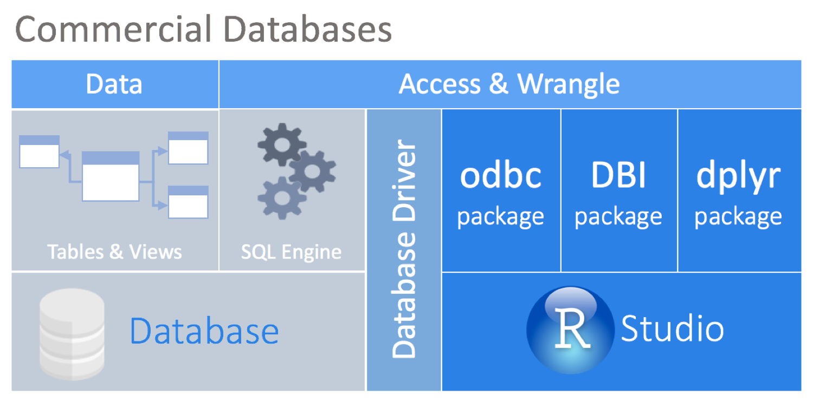
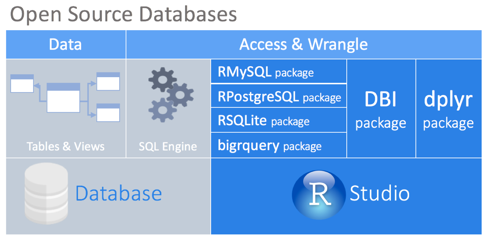
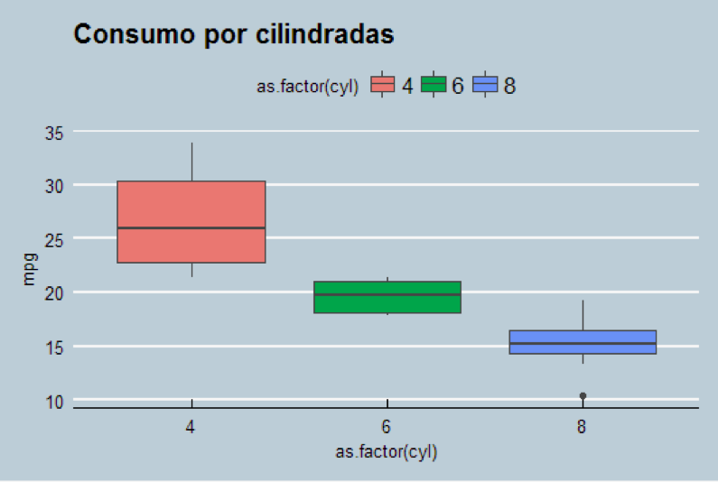

#HSLIDE
# II Encontro de Educação Estatística
Analytics com R e Banco de Dados<br>
Palestrante: Flávio Brito<br>
Data: 25.outubro.2017

Flávio Brito<b>

#HSLIDE

# DBI (R Database Interface)


*Source: RStudio* 

#HSLIDE
# DBI (R Database Interface)


*Source: RStudio* 

#HSLIDE
# DBI (R Database Interface)

* Disponibiliza uma interface comum a maioria dos pacotes do R para bancos de dados. Todas as classes neste pacote são virtuais, sendo assim necessitam ser estendidas por várias implementações utilizando códigos específicos em sub-pacotes
	* RMySQL, RPostgreSQL, ROracle, RSQLite, RJDBC
Utiliza funções para abrir e fechar conexões
dbConnect(), dbDisconnect(),

```R 
con < -  dbConnect(RMySQL::MySQL(),
    username = “usuario",
    password = “senha",
    host = "192.168.100.143",
    port = 3306,
    dbname = "mysql")
```

#HSLIDE
# Utilizando o DBI

* dbListTables() – lista as tabelas do banco de dados
* dbReadTable() e dbWriteTable() – são funções para executar respectivamente a leitura de tabela e escrita de tabelas. O dbReadTable() utiliza o identificados row_names

```R
df < - dbReadTable(con, "funcionario")
```
* dbGetQuery() – submete o comando SQL e retorna o conjunto de dados após o processamento

```R
df_bd < - dbGetQuery(con, "SELECT * FROM user") 
```
As funções dbSendQuery() e fetch() – são utilizados para transmitir grande volume de dados
Outras funções avançadas também estão disponíveis para acesso a definição de schemas, manipulação de transações, e chamada de procedures.
  
#HSLIDE
# SQL Simples

Buscar uma coluna sem filtragem e de forma distinta

```R
df <-dbGetQuery(con, "SELECT DISTINCT codigo FROM pedido")
```
Agregação e ordenação de resultados
```R
df <-dbGetQuery(
    con,
   "SELECT cargo, avg(salario_liquido) as MEDIA_SAL 
    FROM folha 
    GROUP BY cargo 
    ORDER BY MEDIA_SAL DESC"
)
```
#HSLIDE
# Carregando um DF para um Banco de Dados

```R
data("mtcars")

df < - mtcars

dbWriteTable(con,"mtcars",value = df,append = TRUE,
			row.names = FALSE)

dbListTables(con)

df_bd < - dbGetQuery(con, "SELECT * FROM mtcars")
````
```R
head(df_bd, 4)
 mpg cyl disp  hp drat    wt  qsec vs am gear carb
1 21.0   6  160 110 3.90 2.620 16.46  0  1    4    4
2 21.0   6  160 110 3.90 2.875 17.02  0  1    4    4
3 22.8   4  108  93 3.85 2.320 18.61  1  1    4    1
4 21.4   6  258 110 3.08 3.215 19.44  1  0    3    1
```

#HSLIDE
# Indo Além
```R
tabela_B < - dbGetQuery(con, 
			"SELECT * FROM amostras JOIN 
            		tabela_A USING (codigo)")
```
O mesmo resultado do join se consegue em R com a função merge() 
```R
tabela_B < - merge(amostras, tabela_A, by = "codigo")
```
usando a função merge só que para campos com nomes diferentes
```R
tabela_B < -
merge(amostras, tabela_A, by.x =  “cod_am", by.y = “codigo_a")
dbDisconnect(con)
```

#HSLIDE
# Visualizando os Dados

```R
#libraries
require(ggplot2)
require(ggthemes)


df_bd <-dbGetQuery(con, "SELECT * FROM mtcars")

g <-ggplot(df_bd, aes(
    x = as.factor(cyl),
    y = mpg,
    fill = as.factor(cyl)
)) +
    geom_boxplot()
g + theme_economist() + scale_color_economist() + ggtitle("Consumo por cilindradas")
```
#HSLIDE
# Resultado


#HSLIDE
# SQLite

<b>RSQLite</b>: Este pacote embarca a engine do banco de dados SQLite e fornece uma interface compatível com o pacote DBI 
<b>TSSQLite</b>: Forncece uma extensão da interface Tsdbi para o SQLite

```R
con < - dbConnect(RSQLite::SQLite(), ":memory:")
dbWriteTable(con, "iris", iris)
dbGetQuery(con, "SELECT * FROM iris WHERE [Petal.Width] > 2.3")
dbDisconnect(con)
```

#HSLIDE
# SQLITE e dplyr
```R 

library(dplyr)
ID    <- c(1,2,3,4,5)
IDADE <- c(40,45,25,50,60)
CARGO <- c("TECNICO", "ASSISTENTE", "COORDENADOR","AUXILIAR", "GERENTE")
FORMACAO <- c("ESTATISTICA", "ECONOMIA", "SISTEMAS", "DIREITO","LETRAS")
DEPARTAMENTO = c("DEPARTAMENTO A", "DEPARTAMENTO A", "DEPARTAMENTO A","DEPARTAMENTO B","DEPARTAMENTO B")

RH <-data.frame(ID, IDADE, CARGO, FORMACAO, DEPARTAMENTO)
db <- src_sqlite("folha", create = TRUE)
RH.db<- data.frame(copy_to(db,RH,temporary = FALSE))
RH.db <- tbl(db, "RH") #read data from sqlite table
RH.db %>% select(CARGO,DEPARTAMENTO)
      CARGO   DEPARTAMENTO
        <chr>          <chr>
1     TECNICO DEPARTAMENTO A
2  ASSISTENTE DEPARTAMENTO A
...
RH.db %>% filter(DEPARTAMENTO %like% "%A")
    ID IDADE       CARGO    FORMACAO   DEPARTAMENTO
  <dbl> <dbl>       <chr>       <chr>          <chr>
1     1    40     TECNICO ESTATISTICA DEPARTAMENTO A
2     2    45  ASSISTENTE    ECONOMIA DEPARTAMENTO A
...
```


#HSLIDE
# MySQL

<b>RMySQL</b>:  Esta versão está em acordo com as definições implementadas no pacote DBI 0.2-2.
<b>TSMySQL</b>: Ele fornece uma extensão da interface Tsdbi (Time Series Database Interface) para manipulação de séries temporais no MySQL.
```R
con < -  dbConnect(
    RMySQL::MySQL(),
    username = "usuario",
    password = "senha",
    host = "192.168.100.143",
    port = 3306,
    dbname = "mysql"
)
````

#HSLIDE

# PostgreSQL

<b>RPostgreSQL</b>:  Interface R para o Banco de Dados PostgreSQL
<b>TSPostgreSQL</b>: Oferece uma extensão da interface Tsdbi para PostgreSQL
```R
library(RPostgreSQL)
con <-  dbConnect('PostgreSQL',user = 'USUARIO',
        password = ‘SENHA', host = ‘192.168.1.10',port = 5432,
        dbname = ‘MEU_BANCO')
````
```R
data(iris)
dbWriteTable(con, 'iris', iris, row.names = FALSE)
output < - dbGetQuery(con, "SELECT * FROM iris")
```
```R
summary(output)
 Sepal.Length    Sepal.Width     Petal.Length    Petal.Width          Species  
 Min.   :4.300   Min.   :2.000   Min.   :1.000   Min.   :0.100   setosa    :50  
 1st Qu.:5.100   1st Qu.:2.800   1st Qu.:1.600   1st Qu.:0.300   versicolor:50  
 Median :5.800   Median :3.000   Median :4.350   Median :1.300   virginica :50  
 Mean   :5.843   Mean   :3.057   Mean   :3.758   Mean   :1.199                  
 3rd Qu.:6.400   3rd Qu.:3.300   3rd Qu.:5.100   3rd Qu.:1.800                  
 Max.   :7.900   Max.   :4.400   Max.   :6.900   Max.   :2.500 
```

#HSLIDE
# ODBC
```R
library(RODBC)
con <-odbcConnect(“DSN1",uid = "usuario",pwd = "senha",
    rows_at_time = 500)
sqlSave(con, test_table, "TEST_TABLE")
sqlQuery(con, "SELECT COUNT(*) FROM TEST_TABLE")
d < -sqlQuery(con, "SELECT * FROM TEST_TABLE")
close(con)
```
Onde:
odbcConnect(dsn, uid="", pwd="")  - abre uma conexão
sqlFetch(channel, sqtable) – Lê uma tabela para um data frame
sqlQuery(channel, query) 
sqlSave(channel, mydf, tablename = sqtable, append = FALSE) – grava ou atualiza (append =TRUE) um data frame para a tabela na base do ODBC

#HSLIDE
# JDBC

```R
library(RJDBC)
drv < - JDBC("oracle.jdbc.OracleDriver",
    classPath = "…tklocal/instantclient_11_2/ojdbc5.jar", " ")
con < - dbConnect(drv, " jdbc:oracle:thin:@192.168.1.10:1521:db", "usuario", "senha")
dbWriteTable(con, "TEST_TABLE", test_table)
dbGetQuery(con, “SELECT COUNT(*) FROM TEST_TABLE")
d<- dbReadTable(con, "TEST_TABLE")
dbDisconnect(con)
```           
```R
library(ROracle)
drv< - dbDriver("Oracle")
           con< - dbConnect(drv, "usuario", "senha")
           dbWriteTable(con, ”TEST_TABLE”, test_table)
           dbGetQuery(con, “SELECT COUNT(*) FROM TEST_TABLE")
d< - dbReadTable(con, "TEST_TABLE")
dbDisconnect(con)
```

#HSLIDE
# MongoDB
<b>RMongo</b>: Interface para R com MongoDB. Utiliza Java. 
<b>rmongodb</b>: Fornece interface ao MongoDB para R. Removido do CRAN.
<b>mongolite</b> – Interface leve para conexão do R com o MongoDB.
```R
library(RMongo)
mongo < - mongoDbConnect("UNIRIO", "localhost", 27017)
output < -
    dbInsertDocument(
        mongo,
        "evento2",
        '{nome:"Flavio", sobrenome:"Brito", email:"flaviobrito@live.com"}'
```
#HSLIDE

# MongoDB
Continuando ...
```R
db.evento.drop()
db.createCollection('evento');
show collections
db.evento.insert({ nome: "Flavio", sobrenome: "Brito", email: "flaviobrito@live.com" });
db.evento.find()
db.evento.insert([{ nome: "Antonio", sobrenome: "Jose", email: "ajose@gmail.com" }, { nome: "Jose", sobrenome: "Manoel", email: "jmanoel@gmail.com" }]);
db.evento.find()
```
#HSLIDE

# Analytics com R e Banco de Dados 

<center><b>Flávio Brito</b><br>

E-mail: flaviobrito@live.com<br>

Acesso: https://goo.gl/5Dmnar

</center>


